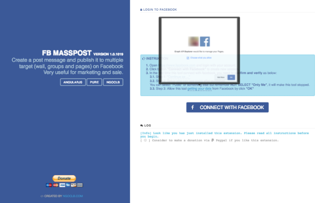

# FB MassPost

This is an extension for Google Chrome, allow user create a post message and publish it to multiple target (wall, groups and pages) on Facebook.

It is very useful for marketing and sale.

***Update to version 1.1.58 (13 May, 2017)***

- Store user session data on cloud
- Add limited for standard users:
  + maximum 10 targets per request
  + up waiting time per each request to 6 hours

### Screenshots

### Download

- [Chrome Store](https://chrome.google.com/webstore/detail/fb-masspost/gbigodjhdibamdnelelannfpcgjjckdn)
- [My website](http://ngoclb.com/project/fb-masspost)

### Report an issue

1. [Github](https://github.com/lbngoc/fb-masspost/issues)
